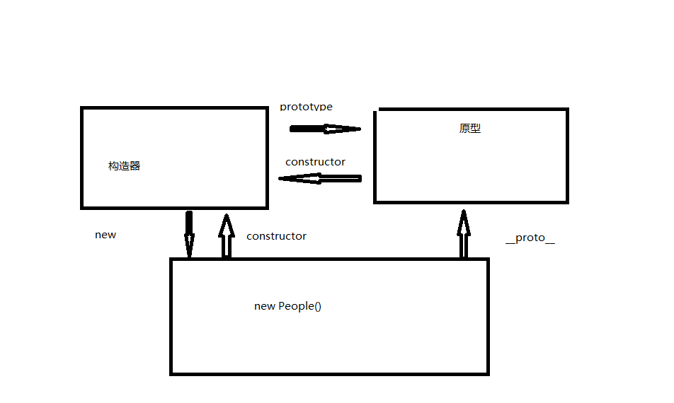
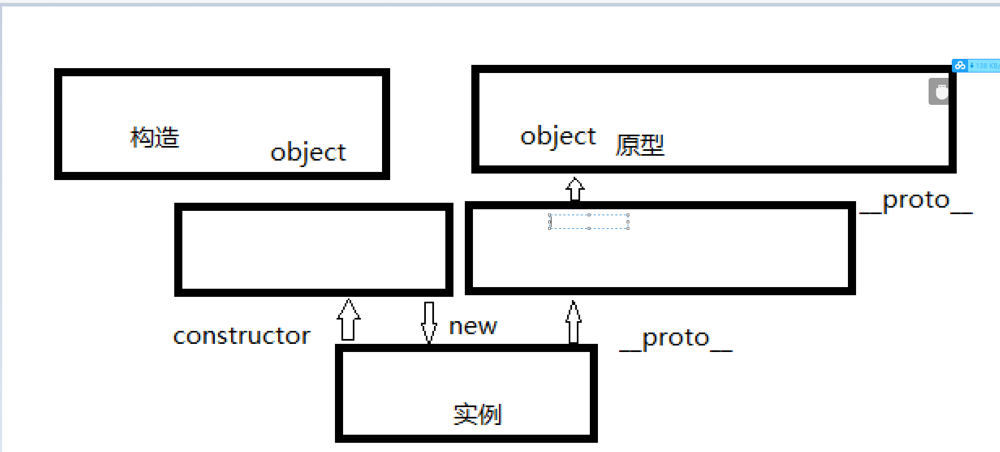

今日目标
====
1. [这是一个typora快捷键介绍的链接，很全](https://www.cnblogs.com/hider/p/11614688.html)
2. git vs svn
3. 原型
4. css中各种居中的解决方案
# 一、git vs svn
* ## 提交代码模式上不同
    * git可分布式版本控制。**每个用户电脑为一个服务器**，犹如cdn地狱式服务器分布那样，可以减少时间等待。
    * svn集中管理在中央服务。**中央服务器控制版本**。
* ## 中央服务器
    * git的中央服务器起到一个临时存储的功能，**灵活性强**。
    * svn对中央服务器高度依赖，**失去灵活性**。
# 二、原型
1. ### 原型、实例、构造函数
   * #### 代码
    ```
        //实例，原型，构造函数
        function People(age,name){
            this.name = name;
            this.age = age;
        }
        var result = new People(18,'lyf');
        //实例的原型 等于构造函数的原型 true
        console.log(result.__proto__== People.prototype);
        //实例的构造函数等于实例 true
        console.log(result.constructor== result.__proto__.constructor); 
    ```
    * #### 图片
    
2. ### 原型链
   * #### 代码
    ```
        //实例，原型，构造函数
        function People(age,name){
            this.name = name;
            this.age = age;
        }
        var result = new People(18,'lyf');
        //实例的原型 等于构造函数的原型 true
        console.log(result.__proto__== People.prototype);
        //实例的构造函数等于实例 true
        console.log(result.constructor== result.__proto__.constructor); 
    ```
   * #### 图片
    


3. #### 继承
   * 代码

    ```
      //实例，原型，构造函数
        //父类
        function People(age,name){
            this.name = name;
            this.age = age;
        }
        //子类
        function Student(code,grade){
            this.code = code;
            this.grade = grade;
        }
        Student.prototype = new People();
        var result = new Student();
        console.log(result);
        //原型链有四层，子类继承父类方法和属性 
    ```
# 三、闭包
* 简单闭包

        //创建闭包最常见的方式函数作为返回值
        var name = "zhang san";
        function foo() {
            var name = "kebi";
            return function () {
                console.log(name);
            };
        }
        var bar = foo();
        bar(); //打印kebi    --外部函数访问内部变
        console.log(name);
        // //解析
        // //全局环境
        // function foo(){}->"00xx11";
        // var bar = "00xx11";
        // //局部环境
        // function foo(){
        //     var name
        //     function->"0055xx";
        //     name = "kebi";
        // }
        // bar() 
* 异步定时器闭包

       //普通的循环
        for (var i = 0; i < 4; i++) {
            setTimeout(function () {
                console.log(i);
            }, 300);
        }
        //4444
        //
        for (var i = 0; i < 4; i++) {
            setTimeout(
                (function (i) {
                    return function () {
                        console.log(i);
                    };
                })(i),
                300
            );
        }
        //0,1,2,3
        //全局环境
        //局部环境
        /* 只执行匿名函数1
        000001 ->"i=0,0000x1";
        000002 ->"i=1,0000x2";
        000002 ->"i=2,0000x3";
        000002 ->"i=3,0000x4";
        0000x1();队列1
        0000x2();队列2
        0000x3();队列3
        0000x4(); */
# 四、CSS居中布局
 ## 1. 水平解决方案
   * 不知父元素宽度，不知自己宽度的解决方法
     1. 子元素display: inline-block; 父元素 text-align: center; text-align 作用于inline级别的元素
     2. 子元素display: table; margin :0 auto; table里的内容就是元素的宽度。
     3. 父元元素相对定位： display: relative; 子元素display: absolute;left: 50%; transform: translateX(-50%);
     4. 父元素：display: flex; justify-content: center;
 ## 2. 垂直水平解决方案    
   * 同上，不定宽不定高的解决方案
     1. 父元素 display: table-cell; vertical-align: center;
     2. 父元元素相对定位： display: relative; 子元素display: absolute; top: 50%; transform: translateY(-50%);
     3. 父元素：display: flex; align-items: center;
 ## 3. 水平垂直同时居中
   * 不定宽高的解决方案
     1. 父元素 display: table-cell; vertical-align: center;text-align: center; 子元素 display: inline-block;
     2. 父元元素相对定位： display: relative; 子元素display: absolute;left: 50%;top: 50%; transform: translateX(-50%); transform: translateY(-50%);
     3. 父元素：display: flex; align-items: center;justify-content: center;
   


​    

   ​     